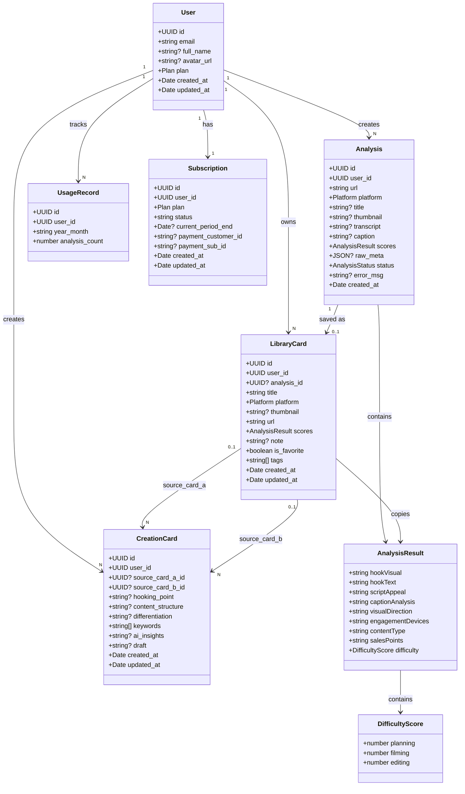
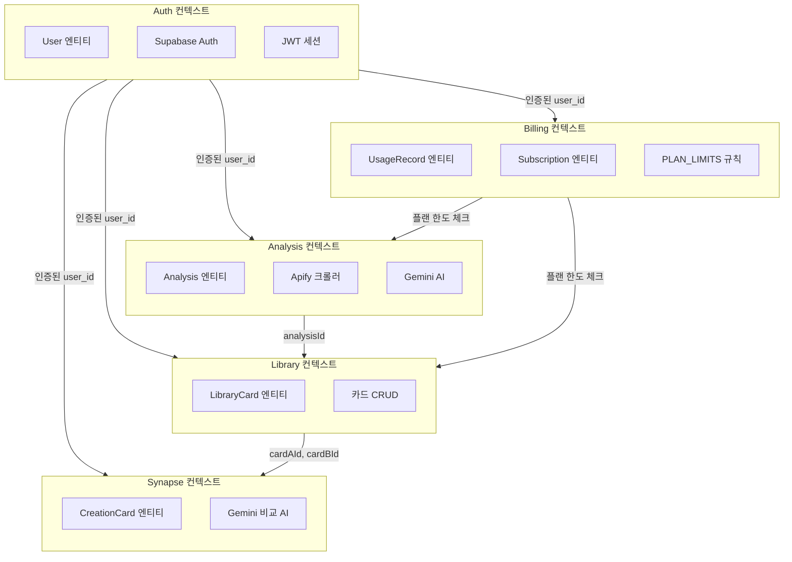

# 01. 도메인 모델

> Last Updated: 2026-02-25
> Source: 코드 자동 분석

---

## 목차

- [1. 핵심 도메인 엔티티](#1-핵심-도메인-엔티티)
- [2. 엔티티 간 관계](#2-엔티티-간-관계)
- [3. Mermaid 클래스 다이어그램](#3-mermaid-클래스-다이어그램)
- [4. 바운디드 컨텍스트](#4-바운디드-컨텍스트)
- [5. 값 객체 (Value Objects)](#5-값-객체-value-objects)

---

## 1. 핵심 도메인 엔티티

### User (사용자)
**위치**: `domains/auth/types.ts`, `supabase/migrations/20260224000000_init_users.sql`

사용자 프로필 및 구독 플랜 정보를 담는 최상위 엔티티. Supabase `auth.users`와 1:1로 연결되며, 트리거를 통해 자동 생성된다.

| 속성 | 타입 | 설명 |
|---|---|---|
| `id` | UUID | Supabase auth.users와 동일한 PK |
| `email` | string | 이메일 (NOT NULL) |
| `full_name` | string? | 표시명 |
| `avatar_url` | string? | 프로필 이미지 URL |
| `plan` | `'starter' \| 'creator' \| 'pro'` | 현재 구독 플랜 |
| `created_at` | timestamp | 가입 일시 |

---

### Analysis (분석 결과)
**위치**: `domains/analysis/types.ts`, `supabase/migrations/20260225000001_analyses.sql`

Apify 크롤링 + Gemini AI가 생성한 9차원 분석 데이터를 저장하는 핵심 엔티티. 각 URL 분석마다 1개 레코드가 생성된다.

| 속성 | 타입 | 설명 |
|---|---|---|
| `id` | UUID | PK |
| `user_id` | UUID | FK → User |
| `url` | string | 분석 대상 URL |
| `platform` | `Platform` | instagram / tiktok / youtube |
| `title` | string? | 콘텐츠 제목 |
| `thumbnail` | string? | 썸네일 이미지 URL |
| `transcript` | string? | 음성→텍스트 변환 결과 |
| `caption` | string? | 원본 캡션 |
| `scores` | `AnalysisResult` | 9차원 분석 결과 (JSONB) |
| `raw_meta` | JSON? | Apify 원본 크롤링 데이터 |
| `status` | `AnalysisStatus` | pending / processing / completed / failed |
| `error_msg` | string? | 실패 시 에러 메시지 |
| `created_at` | timestamp | 분석 일시 |

---

### LibraryCard (라이브러리 카드)
**위치**: `domains/library/types.ts`, `supabase/migrations/20260225000002_library_cards.sql`

사용자가 분석 결과를 저장한 카드. Analysis의 핵심 정보를 복사하여 독립적으로 관리된다.

| 속성 | 타입 | 설명 |
|---|---|---|
| `id` | UUID | PK |
| `user_id` | UUID | FK → User |
| `analysis_id` | UUID | FK → Analysis (삭제 시 SET NULL) |
| `title` | string | 카드 제목 |
| `platform` | `Platform` | 플랫폼 |
| `thumbnail` | string? | 썸네일 URL |
| `url` | string | 원본 URL |
| `scores` | `AnalysisResult` | 9차원 분석 점수 복사본 |
| `note` | string? | 사용자 메모 |
| `is_favorite` | boolean | 즐겨찾기 여부 |
| `tags` | string[] | 태그 목록 |
| `created_at` | timestamp | 저장 일시 |

---

### CreationCard (창작 카드)
**위치**: `domains/synapse/types.ts`, `supabase/migrations/20260225000003_creation_cards.sql`

두 LibraryCard를 AI가 비교 분석하여 생성하는 대본/기획 엔티티. 시냅스 도메인의 핵심 출력물이다.

| 속성 | 타입 | 설명 |
|---|---|---|
| `id` | UUID | PK |
| `user_id` | UUID | FK → User |
| `source_card_a_id` | UUID? | FK → LibraryCard A (삭제 시 SET NULL) |
| `source_card_b_id` | UUID? | FK → LibraryCard B (삭제 시 SET NULL) |
| `hooking_point` | string? | 3초 후킹 포인트 |
| `content_structure` | string? | 콘텐츠 구조/스토리보드 |
| `differentiation` | string? | 차별화 포지셔닝 |
| `keywords` | string[] | 핵심 키워드 |
| `ai_insights` | string? | Gemini 비교 분석 인사이트 |
| `draft` | string? | 완성된 대본 초안 |
| `created_at` | timestamp | 생성 일시 |

---

### UsageRecord (사용량 기록)
**위치**: `domains/billing/types.ts`, `supabase/migrations/20260225000004_billing.sql`

월별 API 사용량을 추적하는 엔티티. UPSERT 방식으로 (user_id, year_month) 복합 UNIQUE 제약을 활용한다.

| 속성 | 타입 | 설명 |
|---|---|---|
| `id` | UUID | PK |
| `user_id` | UUID | FK → User |
| `year_month` | string | 'YYYY-MM' 형식 (e.g. '2026-02') |
| `analysis_count` | number | 해당 월 분석 횟수 |

---

### Subscription (구독)
**위치**: `domains/billing/types.ts`, `supabase/migrations/20260225000004_billing.sql`

사용자의 구독 정보 관리 엔티티. 결제 연동 시 `payment_customer_id`, `payment_sub_id`가 활용된다.

| 속성 | 타입 | 설명 |
|---|---|---|
| `id` | UUID | PK |
| `user_id` | UUID | FK → User (UNIQUE) |
| `plan` | `Plan` | 현재 플랜 |
| `status` | string | active / canceled / past_due |
| `current_period_end` | timestamp? | 현재 구독 기간 종료일 |
| `payment_customer_id` | string? | 결제 게이트웨이 고객 ID |
| `payment_sub_id` | string? | 결제 게이트웨이 구독 ID |

---

## 2. 엔티티 간 관계

```
User (1) ──────────────────────────────────────────────────────────────────── (N) Analysis
  │                                                                                    │
  │                                                                                    │ 1:1 (analysis_id FK)
  │                                                                                    ▼
  │                                                                            LibraryCard (N)
  │                                                                            ┌────────────────┐
  │                                                                            │  source_card_a │
  │                                                                            │  source_card_b │──► CreationCard (N)
  │                                                                            └────────────────┘
  │
  ├──── (1:1) Subscription
  └──── (1:N) UsageRecord (user_id + year_month UNIQUE)
```

**관계 유형 정리**:

| 관계 | 설명 |
|---|---|
| User → Analysis (1:N) | 사용자는 여러 번 분석 가능 |
| User → LibraryCard (1:N) | 사용자는 여러 카드 저장 가능 |
| User → CreationCard (1:N) | 사용자는 여러 Creation Card 생성 가능 |
| User → Subscription (1:1) | 사용자당 하나의 구독 |
| User → UsageRecord (1:N) | 사용자당 월별 사용량 기록 |
| Analysis → LibraryCard (1:1) | 하나의 분석 결과는 하나의 라이브러리 카드로 저장 |
| LibraryCard → CreationCard (M:N) | 두 개의 LibraryCard가 하나의 CreationCard를 만듦 |

---

## 3. Mermaid 클래스 다이어그램



---

## 4. 바운디드 컨텍스트



---

## 5. 값 객체 (Value Objects)

### Platform
```typescript
type Platform = 'instagram' | 'tiktok' | 'youtube'
// 현재 인스타그램만 지원 (tiktok/youtube는 UI에서 disabled)
```

### Plan
```typescript
type Plan = 'starter' | 'creator' | 'pro'
```

### AnalysisStatus
```typescript
type AnalysisStatus = 'pending' | 'processing' | 'completed' | 'failed'
```

### PlanLimit
```typescript
// domains/billing/plan-limits.ts
const PLAN_LIMITS: Record<Plan, PlanLimit> = {
  starter: {
    monthlyAnalysis: 5,
    libraryCards: 10,
    teamMembers: 1,
  },
  creator: {
    monthlyAnalysis: 50,
    libraryCards: Infinity,
    teamMembers: 1,
  },
  pro: {
    monthlyAnalysis: Infinity,
    libraryCards: Infinity,
    teamMembers: 5,
  },
}
```

### FrameData
```typescript
// lib/types.ts
interface FrameData {
  id: string
  timestamp?: number   // 영상 내 타임스탬프 (초)
  imageUrl?: string    // Supabase Storage URL (Phase 8에서 구현 예정)
  description?: string // AI 생성 프레임 설명
}
```

> **참고 문서**: [02_erd.md](./02_erd.md) | [03_data_dictionary.md](./03_data_dictionary.md) | [07_business_rules.md](./07_business_rules.md)
