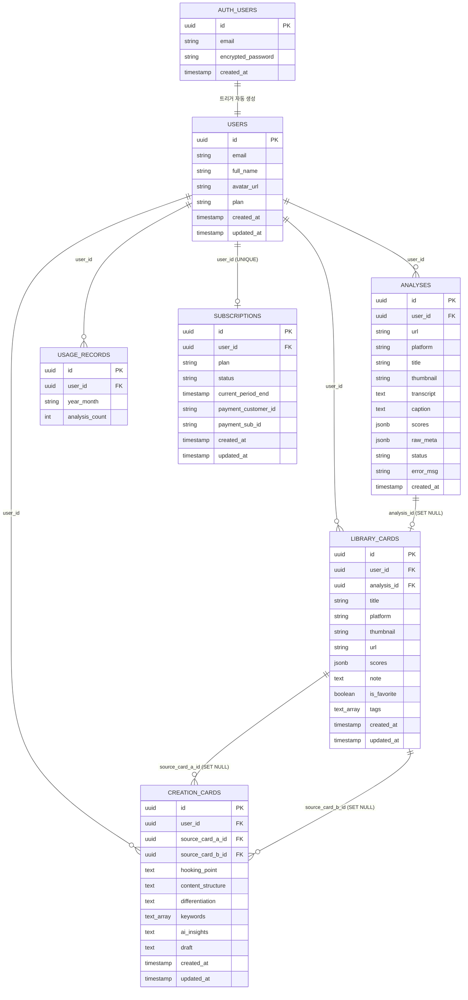

# 02. ERD (Entity Relationship Diagram)

> Last Updated: 2026-02-25
> Source: 코드 자동 분석 (`supabase/migrations/` 파일 기반)

---

## 목차

- [1. 전체 테이블 목록](#1-전체-테이블-목록)
- [2. Mermaid ERD 다이어그램](#2-mermaid-erd-다이어그램)
- [3. 테이블 상세 스키마](#3-테이블-상세-스키마)
- [4. 테이블 간 관계 정의](#4-테이블-간-관계-정의)
- [5. 인덱스 전략](#5-인덱스-전략)
- [6. RLS 정책 요약](#6-rls-정책-요약)
- [7. 함수 / 트리거](#7-함수--트리거)

---

## 1. 전체 테이블 목록

| 스키마 | 테이블명 | 설명 | 마이그레이션 파일 |
|---|---|---|---|
| `auth` | `users` | Supabase 관리 인증 사용자 | Supabase 내부 관리 |
| `public` | `users` | 사용자 프로필 + 구독 플랜 | `20260224000000_init_users.sql` |
| `public` | `analyses` | AI 분석 결과 저장 | `20260225000001_analyses.sql` |
| `public` | `library_cards` | 사용자 라이브러리 카드 | `20260225000002_library_cards.sql` |
| `public` | `creation_cards` | 시냅스 Creation Card (대본) | `20260225000003_creation_cards.sql` |
| `public` | `usage_records` | 월별 API 사용량 | `20260225000004_billing.sql` |
| `public` | `subscriptions` | 구독 정보 | `20260225000004_billing.sql` |

---

## 2. Mermaid ERD 다이어그램



---

## 3. 테이블 상세 스키마

### 3.1 public.users

```sql
CREATE TABLE public.users (
    id          UUID PRIMARY KEY REFERENCES auth.users(id) ON DELETE CASCADE,
    email       TEXT NOT NULL,
    full_name   TEXT,
    avatar_url  TEXT,
    plan        TEXT DEFAULT 'starter'
                    CHECK (plan IN ('starter', 'creator', 'pro')),
    created_at  TIMESTAMPTZ DEFAULT now(),
    updated_at  TIMESTAMPTZ DEFAULT now()
);
```

### 3.2 public.analyses

```sql
CREATE TABLE public.analyses (
    id          UUID PRIMARY KEY DEFAULT gen_random_uuid(),
    user_id     UUID NOT NULL REFERENCES public.users(id) ON DELETE CASCADE,
    url         TEXT NOT NULL,
    platform    TEXT NOT NULL CHECK (platform IN ('instagram', 'tiktok', 'youtube')),
    title       TEXT,
    thumbnail   TEXT,
    transcript  TEXT,
    caption     TEXT,
    scores      JSONB,          -- AnalysisResult (9차원 분석 결과)
    raw_meta    JSONB,          -- Apify 원본 크롤링 데이터
    status      TEXT DEFAULT 'pending'
                    CHECK (status IN ('pending', 'processing', 'completed', 'failed')),
    error_msg   TEXT,
    created_at  TIMESTAMPTZ DEFAULT now()
);
```

**scores JSONB 스키마**:
```json
{
  "hookVisual": "3초 내 시선을 끄는 영상 요소 분석 텍스트",
  "hookText": "3초 내 시선을 끄는 텍스트/자막 분석 텍스트",
  "scriptAppeal": "전체 스크립트 매력도 분석 텍스트",
  "captionAnalysis": "캡션 구성 분석 텍스트",
  "visualDirection": "영상미와 연출 스타일 분석 텍스트",
  "engagementDevices": "댓글/저장/공유 유도 장치 분석 텍스트",
  "contentType": "콘텐츠 유형 분류 텍스트",
  "salesPoints": "세일즈/소구점 분석 텍스트",
  "difficulty": {
    "planning": 3,
    "filming": 2,
    "editing": 4
  }
}
```

### 3.3 public.library_cards

```sql
CREATE TABLE public.library_cards (
    id          UUID PRIMARY KEY DEFAULT gen_random_uuid(),
    user_id     UUID NOT NULL REFERENCES public.users(id) ON DELETE CASCADE,
    analysis_id UUID REFERENCES public.analyses(id) ON DELETE SET NULL,
    title       TEXT NOT NULL,
    platform    TEXT NOT NULL CHECK (platform IN ('instagram', 'tiktok', 'youtube')),
    thumbnail   TEXT,
    url         TEXT NOT NULL,
    scores      JSONB,           -- analyses.scores 복사본
    note        TEXT,
    is_favorite BOOLEAN DEFAULT false,
    tags        TEXT[] DEFAULT '{}',
    created_at  TIMESTAMPTZ DEFAULT now(),
    updated_at  TIMESTAMPTZ DEFAULT now()
);
```

### 3.4 public.creation_cards

```sql
CREATE TABLE public.creation_cards (
    id                UUID PRIMARY KEY DEFAULT gen_random_uuid(),
    user_id           UUID NOT NULL REFERENCES public.users(id) ON DELETE CASCADE,
    source_card_a_id  UUID REFERENCES public.library_cards(id) ON DELETE SET NULL,
    source_card_b_id  UUID REFERENCES public.library_cards(id) ON DELETE SET NULL,
    hooking_point     TEXT,
    content_structure TEXT,
    differentiation   TEXT,
    keywords          TEXT[] DEFAULT '{}',
    ai_insights       TEXT,
    draft             TEXT,
    created_at        TIMESTAMPTZ DEFAULT now(),
    updated_at        TIMESTAMPTZ DEFAULT now()
);
```

### 3.5 public.usage_records

```sql
CREATE TABLE public.usage_records (
    id             UUID PRIMARY KEY DEFAULT gen_random_uuid(),
    user_id        UUID NOT NULL REFERENCES public.users(id) ON DELETE CASCADE,
    year_month     TEXT NOT NULL,    -- 'YYYY-MM' 형식
    analysis_count INT DEFAULT 0,
    UNIQUE(user_id, year_month)
);
```

### 3.6 public.subscriptions

```sql
CREATE TABLE public.subscriptions (
    id                    UUID PRIMARY KEY DEFAULT gen_random_uuid(),
    user_id               UUID NOT NULL UNIQUE REFERENCES public.users(id) ON DELETE CASCADE,
    plan                  TEXT DEFAULT 'starter',
    status                TEXT DEFAULT 'active',
    current_period_end    TIMESTAMPTZ,
    payment_customer_id   TEXT,
    payment_sub_id        TEXT,
    created_at            TIMESTAMPTZ DEFAULT now(),
    updated_at            TIMESTAMPTZ DEFAULT now()
);
```

---

## 4. 테이블 간 관계 정의

| 부모 테이블 | 자식 테이블 | 관계 | FK 컬럼 | 삭제 전략 |
|---|---|---|---|---|
| `auth.users` | `public.users` | 1:1 | `id` | CASCADE |
| `public.users` | `public.analyses` | 1:N | `user_id` | CASCADE |
| `public.users` | `public.library_cards` | 1:N | `user_id` | CASCADE |
| `public.users` | `public.creation_cards` | 1:N | `user_id` | CASCADE |
| `public.users` | `public.usage_records` | 1:N | `user_id` | CASCADE |
| `public.users` | `public.subscriptions` | 1:1 | `user_id` (UNIQUE) | CASCADE |
| `public.analyses` | `public.library_cards` | 1:0..1 | `analysis_id` | SET NULL |
| `public.library_cards` | `public.creation_cards` | 1:N | `source_card_a_id` | SET NULL |
| `public.library_cards` | `public.creation_cards` | 1:N | `source_card_b_id` | SET NULL |

---

## 5. 인덱스 전략

```sql
-- analyses
CREATE INDEX idx_analyses_user_id ON public.analyses(user_id);
CREATE INDEX idx_analyses_created_at ON public.analyses(created_at DESC);

-- library_cards
CREATE INDEX idx_library_cards_user_id ON public.library_cards(user_id);
CREATE INDEX idx_library_cards_created_at ON public.library_cards(created_at DESC);
CREATE INDEX idx_library_cards_platform ON public.library_cards(platform);
CREATE INDEX idx_library_cards_favorite ON public.library_cards(is_favorite) WHERE is_favorite = true;

-- creation_cards
CREATE INDEX idx_creation_cards_user_id ON public.creation_cards(user_id);
CREATE INDEX idx_creation_cards_created_at ON public.creation_cards(created_at DESC);

-- usage_records
-- UNIQUE(user_id, year_month)가 복합 인덱스 역할 수행

-- subscriptions
-- UNIQUE(user_id)가 인덱스 역할 수행
```

---

## 6. RLS 정책 요약

모든 테이블에 Row Level Security(RLS)가 활성화되어 있습니다.

| 테이블 | SELECT | INSERT | UPDATE | DELETE | 비고 |
|---|---|---|---|---|---|
| `users` | 본인만 | — | 본인만 | — | 트리거로 자동 생성 |
| `analyses` | 본인만 | 본인만 | — | 본인만 | — |
| `library_cards` | 본인만 | 본인만 | 본인만 | 본인만 | — |
| `creation_cards` | 본인만 | 본인만 | 본인만 | 본인만 | — |
| `usage_records` | 본인만 | 본인만 | 본인만 | — | UPSERT 방식 |
| `subscriptions` | 본인만 | — | Service Role만 | — | 결제 훅으로만 업데이트 |

```sql
-- 모든 테이블의 기본 RLS 패턴
ALTER TABLE public.[테이블명] ENABLE ROW LEVEL SECURITY;

CREATE POLICY "본인 데이터만" ON public.[테이블명]
    FOR ALL USING (auth.uid() = user_id);
```

---

## 7. 함수 / 트리거

### 신규 사용자 자동 생성 트리거

```sql
-- auth.users에 사용자 생성 시 public.users에 자동 INSERT
CREATE OR REPLACE FUNCTION public.handle_new_user()
RETURNS TRIGGER AS $$
BEGIN
    INSERT INTO public.users (id, email, full_name, avatar_url)
    VALUES (
        new.id,
        new.email,
        new.raw_user_meta_data->>'full_name',
        new.raw_user_meta_data->>'avatar_url'
    );
    RETURN new;
END;
$$ LANGUAGE plpgsql SECURITY DEFINER;

CREATE TRIGGER on_auth_user_created
    AFTER INSERT ON auth.users
    FOR EACH ROW EXECUTE FUNCTION public.handle_new_user();
```

### 사용량 증가 RPC 함수

```sql
-- UPSERT 방식으로 월별 분석 횟수 증가 (Atomic 연산)
CREATE OR REPLACE FUNCTION public.increment_analysis_count(
    p_user_id    UUID,
    p_year_month TEXT
)
RETURNS void AS $$
BEGIN
    INSERT INTO public.usage_records (user_id, year_month, analysis_count)
    VALUES (p_user_id, p_year_month, 1)
    ON CONFLICT (user_id, year_month)
    DO UPDATE SET analysis_count = usage_records.analysis_count + 1;
END;
$$ LANGUAGE plpgsql SECURITY DEFINER;
```

> **참고 문서**: [01_domain_model.md](./01_domain_model.md) | [03_data_dictionary.md](./03_data_dictionary.md)
