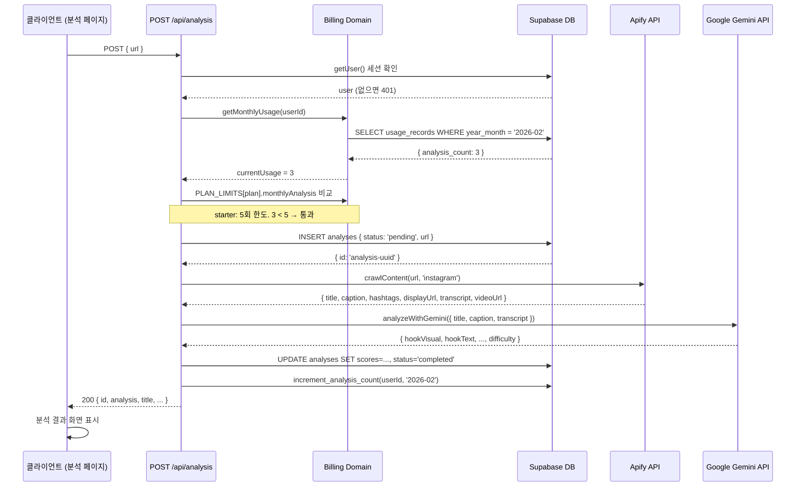
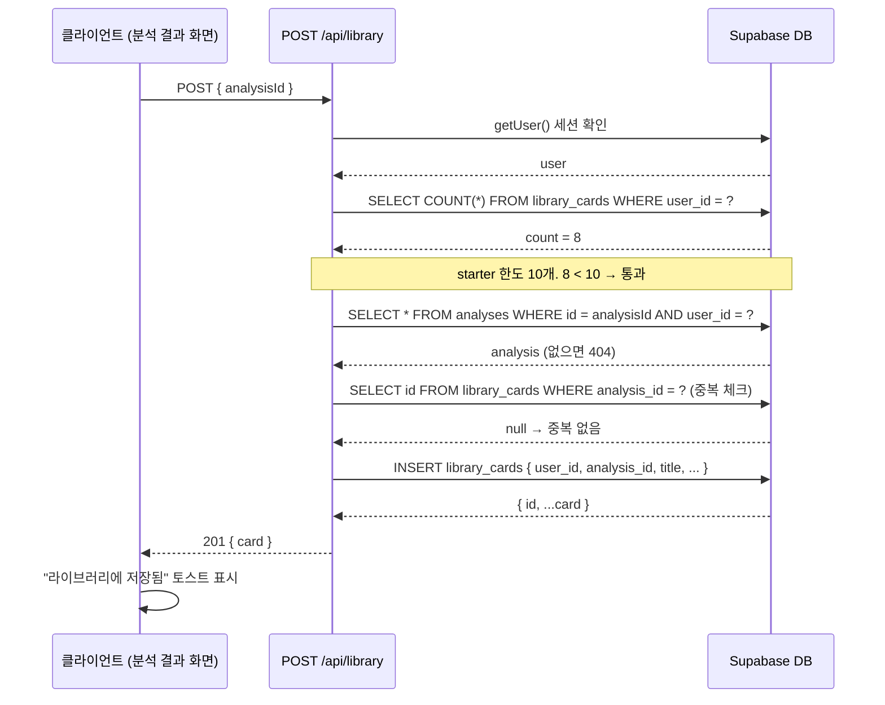
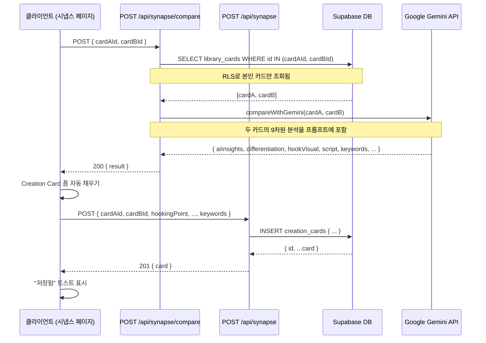
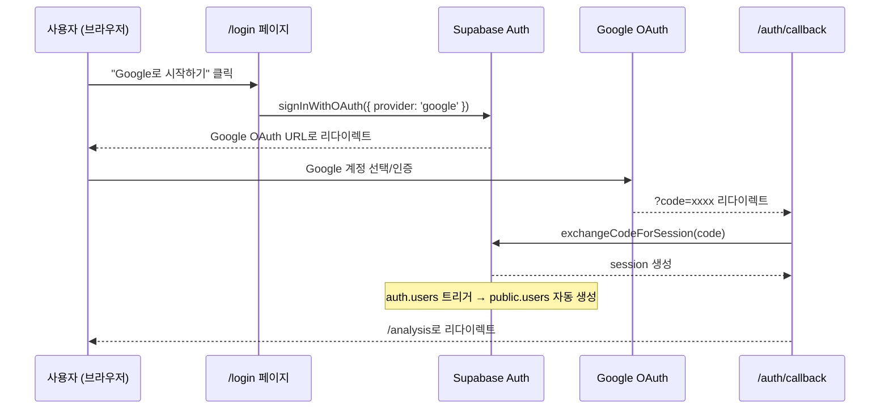

# 04. API 명세 (API Specification)

> Last Updated: 2026-02-25
> Source: 코드 자동 분석 (`app/api/` 파일 기반)

---

## 목차

- [1. 전체 엔드포인트 목록](#1-전체-엔드포인트-목록)
- [2. 공통 규칙](#2-공통-규칙)
- [3. Analysis API](#3-analysis-api)
- [4. Library API](#4-library-api)
- [5. Synapse API](#5-synapse-api)
- [6. Auth API](#6-auth-api)
- [7. 시퀀스 다이어그램](#7-시퀀스-다이어그램)

---

## 1. 전체 엔드포인트 목록

| 메서드 | 경로 | 설명 | 인증 필수 |
|---|---|---|---|
| `POST` | `/api/analysis` | URL → Apify 크롤링 → Gemini AI 분석 → DB 저장 | ✅ |
| `GET` | `/api/library` | 로그인 사용자의 라이브러리 카드 목록 조회 | ✅ |
| `POST` | `/api/library` | 분석 결과를 라이브러리 카드로 저장 | ✅ |
| `PATCH` | `/api/library/[id]` | 카드 메모 또는 즐겨찾기 수정 | ✅ |
| `DELETE` | `/api/library/[id]` | 라이브러리 카드 삭제 | ✅ |
| `GET` | `/api/synapse` | 로그인 사용자의 Creation Card 목록 조회 | ✅ |
| `POST` | `/api/synapse` | Creation Card 저장 | ✅ |
| `POST` | `/api/synapse/compare` | 두 라이브러리 카드 AI 비교 분석 | ✅ |
| `GET` | `/auth/callback` | Google OAuth 인증 콜백 처리 | — |

---

## 2. 공통 규칙

### 인증

모든 보호된 API는 Supabase 세션 쿠키 기반으로 인증을 처리합니다. 클라이언트는 별도 헤더 설정 없이 브라우저 쿠키를 통해 자동 인증됩니다.

```
미인증 요청 → 401 Unauthorized { error: "인증이 필요합니다." }
```

### 응답 형식

모든 응답은 `Content-Type: application/json`입니다.

**성공 응답**:
```json
{ "data": ... }
```

**에러 응답**:
```json
{
  "error": "에러 메시지",
  "code": "ERROR_CODE"  // 선택적
}
```

### 에러 코드 목록

| HTTP 상태 | code | 설명 |
|---|---|---|
| `400` | — | 잘못된 요청 형식 또는 필수 파라미터 누락 |
| `401` | — | 인증 필요 (세션 없음) |
| `403` | `USAGE_LIMIT_EXCEEDED` | 사용량 한도 초과 |
| `403` | — | 라이브러리 카드 한도 초과 |
| `404` | — | 리소스를 찾을 수 없음 |
| `409` | — | 중복 데이터 (이미 저장된 분석 결과) |
| `500` | — | 서버 내부 오류 (AI API 실패, DB 오류 등) |

---

## 3. Analysis API

### POST /api/analysis

**설명**: URL을 입력받아 Apify로 크롤링하고, Gemini AI로 9차원 분석 후 DB에 저장합니다.

**Request**:
```http
POST /api/analysis
Content-Type: application/json

{
  "url": "https://www.instagram.com/reel/xxxxxxx/"
}
```

| 필드 | 타입 | 필수 | 설명 |
|---|---|---|---|
| `url` | string | ✅ | 분석할 콘텐츠 URL (instagram.com/reel/...) |

**Response — 성공 (200)**:
```json
{
  "id": "uuid-...",
  "title": "콘텐츠 제목",
  "platform": "instagram",
  "url": "https://www.instagram.com/reel/xxxxxxx/",
  "thumbnailUrl": "https://...",
  "analysis": {
    "hookVisual": "AI 분석 텍스트",
    "hookText": "AI 분석 텍스트",
    "scriptAppeal": "AI 분석 텍스트",
    "captionAnalysis": "AI 분석 텍스트",
    "visualDirection": "AI 분석 텍스트",
    "engagementDevices": "AI 분석 텍스트",
    "contentType": "AI 분석 텍스트",
    "salesPoints": "AI 분석 텍스트",
    "difficulty": {
      "planning": 3,
      "filming": 2,
      "editing": 4
    }
  },
  "caption": "원본 캡션 텍스트",
  "frames": [],
  "tags": [],
  "createdAt": "2026-02-25T00:00:00.000Z"
}
```

**Response — 에러**:

| 상태 | 조건 | 응답 |
|---|---|---|
| `400` | url 미입력 | `{ "error": "URL이 필요합니다." }` |
| `400` | 지원하지 않는 플랫폼 | `{ "error": "지원하지 않는 플랫폼입니다." }` |
| `401` | 미인증 | `{ "error": "인증이 필요합니다." }` |
| `403` | 사용량 한도 초과 | `{ "error": "이번 달 분석 횟수(5회)를 모두 사용했습니다.", "code": "USAGE_LIMIT_EXCEEDED", "currentUsage": 5, "limit": 5 }` |
| `500` | AI 분석 실패 | `{ "error": "분석 중 오류가 발생했습니다." }` |

---

## 4. Library API

### GET /api/library

**설명**: 로그인 사용자의 라이브러리 카드 목록을 최신순으로 조회합니다.

**Request**:
```http
GET /api/library
```

**Response — 성공 (200)**:
```json
{
  "cards": [
    {
      "id": "uuid-...",
      "title": "콘텐츠 제목",
      "platform": "instagram",
      "thumbnailUrl": "https://...",
      "url": "https://...",
      "analysis": { /* AnalysisResult */ },
      "note": null,
      "isFavorite": false,
      "tags": [],
      "createdAt": "2026-02-25T00:00:00.000Z"
    }
  ]
}
```

---

### POST /api/library

**설명**: 분석 결과를 라이브러리 카드로 저장합니다. 플랜별 저장 한도를 검사합니다.

**Request**:
```http
POST /api/library
Content-Type: application/json

{
  "analysisId": "uuid-..."
}
```

| 필드 | 타입 | 필수 | 설명 |
|---|---|---|---|
| `analysisId` | string | ✅ | 저장할 분석 결과 ID |

**Response — 성공 (201)**:
```json
{
  "card": { /* ContentCard */ }
}
```

**Response — 에러**:

| 상태 | 조건 | 응답 |
|---|---|---|
| `400` | analysisId 누락 | `{ "error": "analysisId가 필요합니다." }` |
| `403` | 카드 한도 초과 | `{ "error": "라이브러리 한도(10개) 초과" }` |
| `404` | 분석 결과 없음 | `{ "error": "분석 결과를 찾을 수 없습니다." }` |
| `409` | 이미 저장됨 | `{ "error": "이미 라이브러리에 저장된 콘텐츠입니다." }` |

---

### PATCH /api/library/[id]

**설명**: 라이브러리 카드의 메모 또는 즐겨찾기를 수정합니다.

**Request**:
```http
PATCH /api/library/{id}
Content-Type: application/json

{
  "note": "내 메모",
  "isFavorite": true
}
```

| 필드 | 타입 | 필수 | 설명 |
|---|---|---|---|
| `note` | string | 선택 | 사용자 메모 (null 허용) |
| `isFavorite` | boolean | 선택 | 즐겨찾기 여부 |

**Response — 성공 (200)**:
```json
{
  "card": { /* 업데이트된 ContentCard */ }
}
```

---

### DELETE /api/library/[id]

**설명**: 라이브러리 카드를 삭제합니다.

**Request**:
```http
DELETE /api/library/{id}
```

**Response — 성공 (200)**:
```json
{ "success": true }
```

**Response — 에러**:

| 상태 | 조건 | 응답 |
|---|---|---|
| `404` | 카드 없음 또는 타인 소유 | `{ "error": "카드를 찾을 수 없습니다." }` |

---

## 5. Synapse API

### GET /api/synapse

**설명**: 로그인 사용자의 Creation Card 목록을 최신순으로 조회합니다.

**Request**:
```http
GET /api/synapse
```

**Response — 성공 (200)**:
```json
{
  "cards": [
    {
      "id": "uuid-...",
      "sourceCardAId": "uuid-...",
      "sourceCardBId": "uuid-...",
      "hookingPoint": "후킹 포인트",
      "contentStructure": "스토리보드",
      "differentiation": "차별화 전략",
      "keywords": ["키워드1", "키워드2"],
      "aiInsights": "AI 인사이트",
      "draft": null,
      "createdAt": "2026-02-25T00:00:00.000Z"
    }
  ]
}
```

---

### POST /api/synapse

**설명**: 사용자가 편집한 Creation Card를 DB에 저장합니다.

**Request**:
```http
POST /api/synapse
Content-Type: application/json

{
  "cardAId": "uuid-...",
  "cardBId": "uuid-...",
  "hookingPoint": "3초 후킹 포인트",
  "contentStructure": "스토리보드/구조",
  "differentiation": "차별화 포지셔닝",
  "keywords": ["키워드1", "키워드2"],
  "aiInsights": "AI 인사이트 텍스트",
  "draft": null
}
```

| 필드 | 타입 | 필수 | 설명 |
|---|---|---|---|
| `cardAId` | string | 선택 | 카드 A의 library_cards ID |
| `cardBId` | string | 선택 | 카드 B의 library_cards ID |
| `hookingPoint` | string | 선택 | 후킹 포인트 |
| `contentStructure` | string | 선택 | 콘텐츠 구조/스토리보드 |
| `differentiation` | string | 선택 | 차별화 전략 |
| `keywords` | string[] | 선택 | 핵심 키워드 목록 |
| `aiInsights` | string | 선택 | AI 인사이트 텍스트 |
| `draft` | string | 선택 | 완성 대본 (향후) |

**Response — 성공 (201)**:
```json
{
  "card": { /* CreationCard */ }
}
```

---

### POST /api/synapse/compare

**설명**: 두 라이브러리 카드를 Gemini AI로 비교 분석하여 Creation Card 초안 데이터를 반환합니다.

**Request**:
```http
POST /api/synapse/compare
Content-Type: application/json

{
  "cardAId": "uuid-...",
  "cardBId": "uuid-..."
}
```

| 필드 | 타입 | 필수 | 설명 |
|---|---|---|---|
| `cardAId` | string | ✅ | 비교할 카드 A의 library_cards ID |
| `cardBId` | string | ✅ | 비교할 카드 B의 library_cards ID |

**Response — 성공 (200)**:
```json
{
  "result": {
    "aiInsights": "두 콘텐츠 핵심 성공 요소 비교 분석",
    "differentiation": "새 콘텐츠 차별화 포지셔닝 전략",
    "hookVisual": "3초 후킹 영상 요소 제안",
    "hookText": "3초 후킹 텍스트 제안",
    "script": "전체 스크립트 초안",
    "caption": "캡션 초안",
    "storyboard": "연출 방향 및 스토리보드",
    "engagement": "인게이지먼트 유도 요소",
    "salesPoints": "세일즈 포인트",
    "difficulty": "난이도 평가",
    "contentType": "콘텐츠 유형",
    "keywords": ["키워드1", "키워드2", "키워드3"]
  }
}
```

**Response — 에러**:

| 상태 | 조건 | 응답 |
|---|---|---|
| `400` | cardAId 또는 cardBId 누락 | `{ "error": "cardAId, cardBId가 필요합니다." }` |
| `404` | 카드를 찾을 수 없음 | `{ "error": "카드를 찾을 수 없습니다." }` |
| `500` | AI 비교 실패 | `{ "error": "비교 분석 중 오류가 발생했습니다." }` |

---

## 6. Auth API

### GET /auth/callback

**설명**: Google OAuth 인증 완료 후 Supabase가 리다이렉트하는 콜백 엔드포인트.

**Query Params**:

| 파라미터 | 타입 | 설명 |
|---|---|---|
| `code` | string | Supabase OAuth 인증 코드 |

**동작**:
1. `code`를 받아 Supabase `exchangeCodeForSession()` 호출
2. 성공 시 `/analysis`로 리다이렉트
3. 실패 시 `/login?error=...`으로 리다이렉트

---

## 7. 시퀀스 다이어그램

### 7.1 AI 분석 전체 플로우



### 7.2 라이브러리 저장 플로우



### 7.3 시냅스 비교 분석 플로우



### 7.4 Google OAuth 로그인 플로우



### 7.5 사용량 한도 초과 플로우

```mermaid
sequenceDiagram
    participant 클라이언트 as 클라이언트
    participant API as POST /api/analysis
    participant Billing as Billing Domain

    클라이언트->>API: POST { url }
    API->>Billing: getMonthlyUsage(userId) → 5
    API->>Billing: PLAN_LIMITS['starter'].monthlyAnalysis → 5

    Note over API,Billing: 5 >= 5 → 한도 초과!

    API-->>클라이언트: 403 {
        "error": "이번 달 분석 횟수(5회)를 모두 사용했습니다.",
        "code": "USAGE_LIMIT_EXCEEDED",
        "currentUsage": 5,
        "limit": 5
    }
    클라이언트->>클라이언트: 업그레이드 유도 모달 표시
```

> **참고 문서**: [05_architecture.md](./05_architecture.md) | [07_business_rules.md](./07_business_rules.md)
