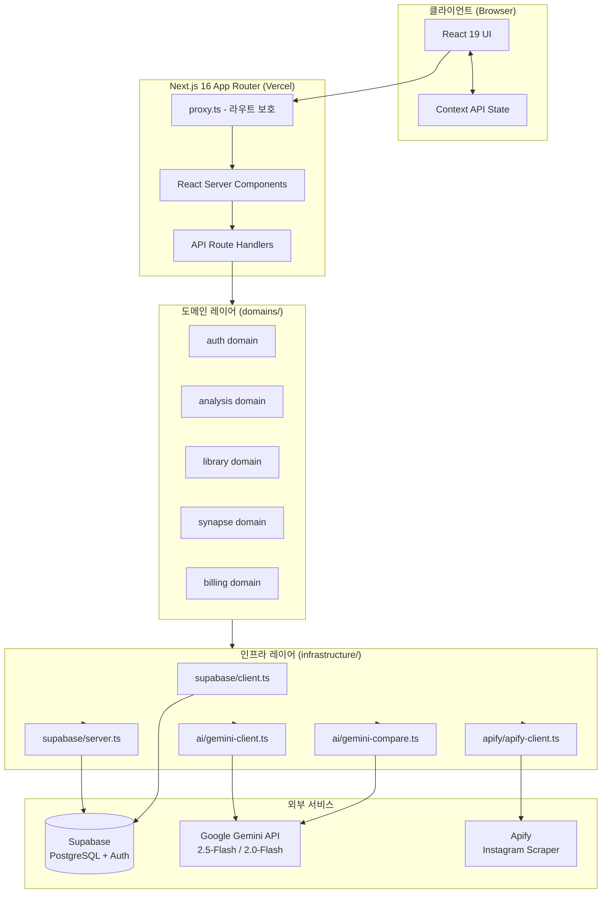
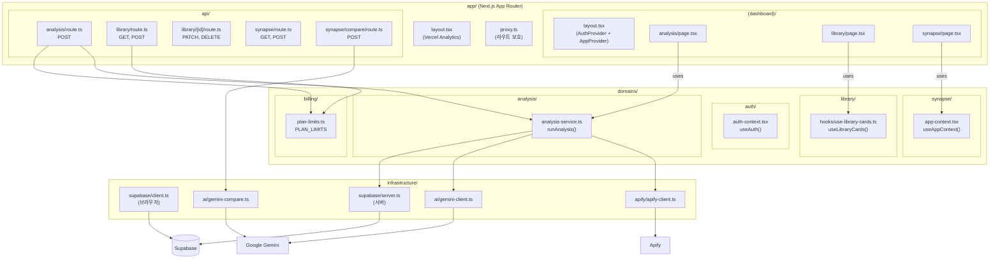
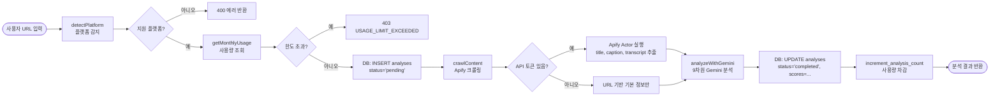
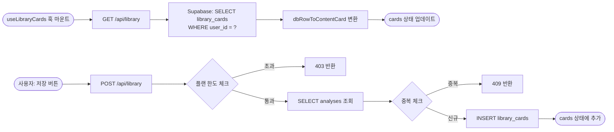
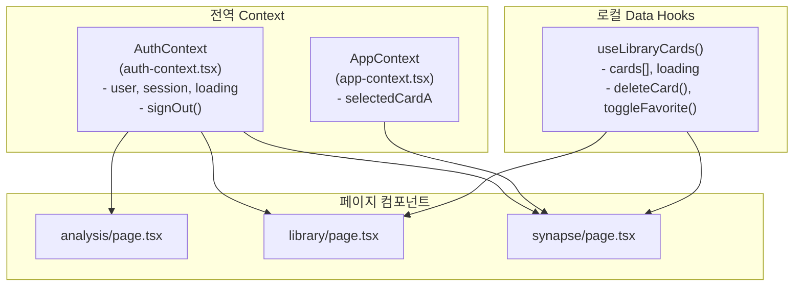

# 05. 시스템 아키텍처

> Last Updated: 2026-02-25
> Source: 코드 자동 분석

---

## 목차

- [1. 전체 시스템 아키텍처 개요](#1-전체-시스템-아키텍처-개요)
- [2. 레이어 구조](#2-레이어-구조)
- [3. 컴포넌트 다이어그램](#3-컴포넌트-다이어그램)
- [4. 데이터 흐름 다이어그램](#4-데이터-흐름-다이어그램)
- [5. 외부 연동 서비스](#5-외부-연동-서비스)
- [6. 인증 아키텍처](#6-인증-아키텍처)
- [7. 라우팅 아키텍처](#7-라우팅-아키텍처)
- [8. 상태 관리 아키텍처](#8-상태-관리-아키텍처)

---

## 1. 전체 시스템 아키텍처 개요

DotLink는 **Next.js 16 App Router** 기반의 풀스택 애플리케이션으로, **Domain-Driven Design(DDD)** 구조를 적용하여 비즈니스 로직을 도메인 단위로 분리합니다.



---

## 2. 레이어 구조

### 레이어 계층도

```
┌──────────────────────────────────────────────────────────────────────┐
│                         프레젠테이션 레이어                              │
│  app/(dashboard)/*/page.tsx  │  components/analysis, library, synapse │
│  React 19 Client Components  │  shadcn/ui + Tailwind CSS v4            │
├──────────────────────────────────────────────────────────────────────┤
│                          라우팅/보안 레이어                              │
│  proxy.ts (Next.js 16 middleware)  │  app/api/* Route Handlers         │
│  JWT 세션 기반 라우트 보호            │  HTTP API 엔드포인트               │
├──────────────────────────────────────────────────────────────────────┤
│                         도메인/비즈니스 레이어                            │
│  domains/auth/          domains/analysis/        domains/library/     │
│  domains/synapse/       domains/billing/                               │
│  - 비즈니스 규칙         - 타입 정의              - 훅 & 서비스             │
├──────────────────────────────────────────────────────────────────────┤
│                          인프라/연동 레이어                              │
│  infrastructure/supabase/   infrastructure/ai/   infrastructure/apify/ │
│  - DB 클라이언트              - Gemini API 래퍼   - Apify Actor 래퍼      │
├──────────────────────────────────────────────────────────────────────┤
│                           외부 서비스 레이어                             │
│  Supabase (PostgreSQL + Auth + RLS)                                  │
│  Google Gemini API (2.5-Flash, 2.0-Flash)                            │
│  Apify (instagram-reel-scraper)                                      │
└──────────────────────────────────────────────────────────────────────┘
```

### 레이어별 책임

| 레이어 | 위치 | 책임 |
|---|---|---|
| **프레젠테이션** | `app/(dashboard)/`, `components/` | UI 렌더링, 사용자 인터랙션 |
| **라우팅/보안** | `proxy.ts`, `app/api/` | 라우트 보호, HTTP 요청 처리 |
| **도메인** | `domains/` | 비즈니스 로직, 타입 정의, 데이터 훅 |
| **인프라** | `infrastructure/` | 외부 서비스 추상화 (DB, AI, 크롤러) |
| **외부** | — | Supabase, Gemini, Apify |

---

## 3. 컴포넌트 다이어그램



---

## 4. 데이터 흐름 다이어그램

### AI 분석 파이프라인



### 라이브러리 데이터 흐름



---

## 5. 외부 연동 서비스

### Supabase

| 기능 | 설명 |
|---|---|
| **PostgreSQL** | 6개 테이블 (users, analyses, library_cards, creation_cards, usage_records, subscriptions) |
| **RLS** | 모든 테이블에 Row Level Security 활성화, 사용자는 본인 데이터만 접근 |
| **Auth** | Email/Password + Google OAuth, JWT 세션 관리 |
| **RPC** | `increment_analysis_count()` 원자적 카운터 증가 |
| **Trigger** | `on_auth_user_created`: auth.users → public.users 자동 생성 |

**클라이언트 종류**:
- `infrastructure/supabase/client.ts`: 브라우저 컴포넌트용 (`createBrowserClient`)
- `infrastructure/supabase/server.ts`: API Route Handler / RSC용 (`createServerClient`)

### Google Gemini API

| 모델 | 사용처 | 이유 |
|---|---|---|
| `gemini-2.5-flash` | 9차원 콘텐츠 분석 | 최신 모델, 분석 정확도 우선 |
| `gemini-2.0-flash` | 두 카드 비교 분석 | 빠른 생성 속도 우선 |

**재시도 로직**: 5회까지 지수 백오프(exponential backoff)로 재시도 (`generateWithRetry` 함수)

### Apify

| Actor | `apify~instagram-reel-scraper` |
|---|---|
| 입력 | `{ startUrls: [{ url }], resultsLimit: 1 }` |
| 주요 출력 | `shortCode`, `caption`, `hashtags[]`, `displayUrl`, `videoDuration`, `videoPlayCount`, `likesCount`, `transcript`, `videoUrl` |
| 타임아웃 | 120초 (`waitForFinish=120`) |
| API 키 없을 때 | URL만으로 기본 정보 반환, 분석 정확도 저하 |

> ⚠️ 추정: TikTok/YouTube Actor ID는 아직 코드에 반영되지 않음. UI에서 disabled 처리됨.

---

## 6. 인증 아키텍처

```mermaid
flowchart TD
    subgraph Browser["브라우저"]
        A[사용자]
        B[React 컴포넌트\nuseAuth() 훅]
    end

    subgraph Server["Next.js 서버"]
        C[proxy.ts\n세션 쿠키 검증]
        D[API Route Handlers\ncreateServerClient]
    end

    subgraph Supabase["Supabase"]
        E[Auth Service\nJWT 발급]
        F[public.users\n프로필 테이블]
    end

    A -->|이메일/비밀번호\n또는 Google OAuth| E
    E -->|세션 쿠키 설정| B
    B -->|모든 요청에 쿠키 포함| C
    C -->|인증 실패 시| LOGIN[/login 리다이렉트]
    C -->|인증 성공 시| D
    D -->|createServerClient| E
    E -->|getUser()| D
    E -->|트리거| F
```

**proxy.ts 라우트 보호 규칙**:

| 경로 | 규칙 |
|---|---|
| `/analysis`, `/library`, `/synapse`, `/feature-request` | 미인증 시 `/login`으로 리다이렉트 |
| `/login` | 인증된 상태면 `/analysis`로 리다이렉트 |
| `/`, `/api/*`, `/auth/callback` | 보호 없음 |

---

## 7. 라우팅 아키텍처

```
/                              → 랜딩 페이지 (공개)
/login                         → 로그인/회원가입 (인증 시 /analysis로)
/auth/callback                 → Google OAuth 콜백
/(dashboard)                   → 인증 필요 라우트 그룹
  /analysis                    → DNA 분석 페이지
  /library                     → 라이브러리 페이지
  /synapse                     → 시냅스 페이지
  /feature-request             → 기능 요청 페이지
/api/analysis                  → 분석 API (POST)
/api/library                   → 라이브러리 API (GET, POST)
/api/library/[id]              → 라이브러리 개별 API (PATCH, DELETE)
/api/synapse                   → 시냅스 API (GET, POST)
/api/synapse/compare           → 시냅스 비교 API (POST)
```

---

## 8. 상태 관리 아키텍처

DotLink는 별도의 전역 상태 관리 라이브러리(Redux, Zustand 등) 없이 **React Context API**만 사용합니다.



**Context 분리 원칙**:
- `AuthContext`: 인증/세션 전역 상태 (레이아웃 레벨에서 제공)
- `AppContext`: 페이지 간 공유가 필요한 UI 상태 (selectedCardA)
- `useLibraryCards()`: 서버 데이터를 관리하는 로컬 훅 (fetch + 캐싱)

> **참고 문서**: [06_adr.md](./06_adr.md) | [04_api_spec.md](./04_api_spec.md) | [07_business_rules.md](./07_business_rules.md)
