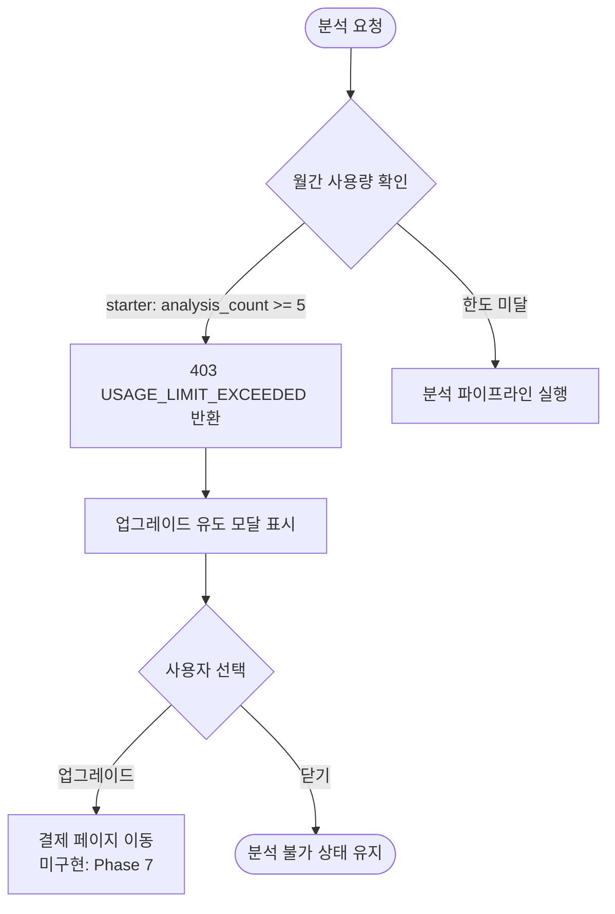

# 07. 비즈니스 규칙 (Business Rules)

> Last Updated: 2026-02-25
> Source: 코드 자동 분석 (`domains/billing/plan-limits.ts`, `app/api/*/route.ts`, `domains/analysis/analysis-service.ts`)

---

## 목차

- [1. 구독 플랜 규칙](#1-구독-플랜-규칙)
- [2. AI 분석 규칙](#2-ai-분석-규칙)
- [3. 라이브러리 규칙](#3-라이브러리-규칙)
- [4. 시냅스 / Creation Card 규칙](#4-시냅스--creation-card-규칙)
- [5. 인증 / 접근 제어 규칙](#5-인증--접근-제어-규칙)
- [6. 유효성 검사 규칙](#6-유효성-검사-규칙)
- [7. 핵심 유스케이스 플로우](#7-핵심-유스케이스-플로우)

---

## 1. 구독 플랜 규칙

### 1.1 플랜별 한도

```typescript
// domains/billing/plan-limits.ts
const PLAN_LIMITS = {
  starter: {
    monthlyAnalysis: 5,      // 월 5회 분석
    libraryCards: 10,         // 라이브러리 최대 10개 카드
    teamMembers: 1,           // 팀원 1명 (본인만)
  },
  creator: {
    monthlyAnalysis: 50,      // 월 50회 분석
    libraryCards: Infinity,   // 라이브러리 무제한
    teamMembers: 1,
  },
  pro: {
    monthlyAnalysis: Infinity, // 무제한 분석
    libraryCards: Infinity,
    teamMembers: 5,            // 팀원 5명
  },
}
```

### 1.2 플랜 결정 기준

- 신규 가입 사용자 기본 플랜: `starter`
- `public.users.plan` 컬럼이 플랜을 결정함
- 구독 취소 후: `subscriptions.status = 'canceled'`이지만, `current_period_end`까지는 서비스 이용 가능

> ⚠️ 추정: `current_period_end` 이후 플랜 다운그레이드 로직은 아직 미구현. 결제 게이트웨이 웹훅 수신 시 처리 예정.

### 1.3 한도 초과 시 동작

| 한도 종류 | 초과 시 동작 | 에러 코드 |
|---|---|---|
| 월간 분석 횟수 | `403` 반환 + 업그레이드 유도 메시지 | `USAGE_LIMIT_EXCEEDED` |
| 라이브러리 카드 수 | `403` 반환 + 업그레이드 안내 | — |

---

## 2. AI 분석 규칙

### 2.1 지원 플랫폼

| 플랫폼 | 지원 여부 | 처리 방식 |
|---|---|---|
| `instagram` | ✅ 지원 | Apify `instagram-reel-scraper` Actor |
| `tiktok` | 🔲 미지원 | UI에서 disabled, API에서 에러 throw |
| `youtube` | 🔲 미지원 | UI에서 disabled, API에서 에러 throw |

### 2.2 분석 파이프라인 규칙

1. **URL 필수**: `url`이 빈 문자열이거나 없으면 `400` 반환
2. **플랫폼 감지**: URL에서 자동으로 플랫폼 감지 (`detectPlatform`)
   - `instagram.com` 포함 → `instagram`
   - `tiktok.com` 포함 → `tiktok`
   - `youtube.com` 또는 `youtu.be` 포함 → `youtube`
3. **사용량 선제 체크**: 분석 실행 전에 한도 확인 (분석 실행 후 초과 불가)
4. **상태 관리**: `pending` → `processing` → `completed` or `failed`
5. **실패 기록**: 분석 실패 시 `status = 'failed'`, `error_msg`에 원인 기록
6. **사용량 차감**: 분석 **성공 후**에만 `analysis_count` 증가 (실패 시 차감 없음)

### 2.3 Apify 크롤링 규칙

- APIFY_API_TOKEN 없을 때: URL만으로 기본 분석 (title = URL, 정확도 낮음)
- APIFY_API_TOKEN 있을 때: 제목, 캡션, 해시태그, 조회수, 좋아요수, 자막 추출
- 타임아웃 초과(120초): 에러 처리, `status = 'failed'`

### 2.4 Gemini 분석 규칙

- 9차원 분석은 반드시 JSON 형식으로 반환 요청
- JSON 파싱 실패 시 최대 5회 재시도 (exponential backoff)
- 5회 모두 실패 시 분석 실패 처리

### 2.5 9차원 분석 항목

| 차원 | 키 | 설명 |
|---|---|---|
| 1. 시각 후킹 | `hookVisual` | 3초 내 시선을 끄는 영상 요소 |
| 2. 텍스트 후킹 | `hookText` | 3초 내 시선을 끄는 텍스트/자막 |
| 3. 스크립트 매력도 | `scriptAppeal` | 전체 스크립트의 매력도 |
| 4. 캡션 분석 | `captionAnalysis` | 캡션의 구성과 효과 |
| 5. 영상 연출 | `visualDirection` | 영상미와 연출 스타일 |
| 6. 인게이지먼트 | `engagementDevices` | 댓글/저장/공유 유도 장치 |
| 7. 콘텐츠 유형 | `contentType` | 정보성/감성/엔터테인먼트 등 유형 분류 |
| 8. 세일즈 포인트 | `salesPoints` | 세일즈/소구점 |
| 9. 제작 난이도 | `difficulty` | 기획/촬영/편집 각 1~5점 |

---

## 3. 라이브러리 규칙

### 3.1 저장 가능 조건

- 분석 결과(`analyses` 테이블)의 `status = 'completed'`인 경우만 저장 가능
- 타인의 분석 결과는 저장 불가 (RLS: `user_id` 일치 확인)
- 동일 `analysis_id`는 한 번만 저장 가능 (중복 저장 시 `409` 반환)
- 플랜별 카드 수 한도 초과 불가

### 3.2 카드 수정 규칙

- 수정 가능한 필드: `note` (메모), `is_favorite` (즐겨찾기), `tags` (태그)
- 수정 불가 필드: `title`, `platform`, `url`, `scores`, `analysis_id`
- 본인 카드만 수정 가능 (RLS)

### 3.3 카드 삭제 규칙

- 카드 삭제 시 연관된 `creation_cards.source_card_a_id` / `source_card_b_id`는 `NULL`로 설정 (`ON DELETE SET NULL`)
- 원본 `analyses` 레코드는 삭제되지 않음

### 3.4 조회 규칙

- 최신순(`created_at DESC`)으로 반환
- 본인 카드만 조회 가능 (RLS)

---

## 4. 시냅스 / Creation Card 규칙

### 4.1 비교 분석 조건

- `cardAId`와 `cardBId` 모두 필수
- 두 카드 모두 본인 소유여야 함 (RLS: `user_id` 일치)
- 같은 카드를 A/B 모두 선택하는 것도 기술적으로 허용 (비즈니스 제한 없음)

> ⚠️ 추정: 같은 카드 선택 시 의미 있는 분석이 되지 않을 수 있으나, 현재 코드에서는 이를 막지 않음.

### 4.2 AI 비교 분석 결과 필드

| 필드 | 설명 |
|---|---|
| `aiInsights` | 두 콘텐츠 핵심 성공 요소 비교 분석 |
| `differentiation` | 새 콘텐츠의 차별화 포지셔닝 |
| `hookVisual` | 새 콘텐츠의 3초 후킹 영상 요소 |
| `hookText` | 새 콘텐츠의 3초 후킹 텍스트 |
| `script` | 전체 스크립트 초안 |
| `caption` | 캡션 초안 |
| `storyboard` | 연출 방향 및 스토리보드 |
| `engagement` | 인게이지먼트 유도 요소 |
| `salesPoints` | 세일즈 포인트 |
| `difficulty` | 난이도 평가 |
| `contentType` | 콘텐츠 유형 |
| `keywords` | 핵심 키워드 배열 |

### 4.3 Creation Card 저장 규칙

- 모든 필드 선택적 (null 허용)
- 저장 시 소유권 기록: `user_id` 필수
- 본인 Creation Card만 조회/수정/삭제 가능

---

## 5. 인증 / 접근 제어 규칙

### 5.1 라우트 보호 규칙

| 경로 패턴 | 미인증 접근 | 인증 상태 접근 |
|---|---|---|
| `/analysis`, `/library`, `/synapse`, `/feature-request` | `/login`으로 리다이렉트 | 정상 접근 |
| `/login` | 정상 접근 | `/analysis`로 리다이렉트 |
| `/` (랜딩) | 정상 접근 | 정상 접근 |
| `/api/*` | `401` 반환 | 정상 처리 |

### 5.2 데이터 접근 제어 (RLS)

- 모든 테이블에 RLS 활성화
- 원칙: `auth.uid() = user_id` (본인 데이터만 접근)
- 예외: `subscriptions` 테이블 UPDATE는 Service Role만 (결제 훅)

### 5.3 서버/클라이언트 분리 규칙

- 클라이언트 컴포넌트에서 `server.ts` 사용 금지
- API Route Handler에서는 반드시 `server.ts` 사용
- `NEXT_PUBLIC_` 접두사로 서버 전용 시크릿 노출 금지

---

## 6. 유효성 검사 규칙

### 6.1 URL 유효성

```typescript
// URL 필수 확인
if (!url || url.trim() === '') {
  return 400: { error: "URL이 필요합니다." }
}

// 플랫폼 감지 실패 시
if (!platform) {
  return 400: { error: "지원하지 않는 플랫폼입니다." }
}
```

### 6.2 분석 ID 유효성

```typescript
// POST /api/library
if (!body.analysisId) {
  return 400: { error: "analysisId가 필요합니다." }
}

// 분석 결과 존재 + 소유권 확인
const analysis = await supabase
  .from('analyses')
  .select('*')
  .eq('id', body.analysisId)
  .eq('user_id', user.id)  // 본인 소유 확인
  .single()

if (!analysis) {
  return 404: { error: "분석 결과를 찾을 수 없습니다." }
}
```

### 6.3 비교 카드 유효성

```typescript
// POST /api/synapse/compare
if (!cardAId || !cardBId) {
  return 400: { error: "cardAId, cardBId가 필요합니다." }
}

// 두 카드 모두 본인 소유 확인 (RLS로 자동 필터링)
const cards = await supabase
  .from('library_cards')
  .select('*')
  .in('id', [cardAId, cardBId])
  // user_id는 RLS가 자동으로 필터링
```

### 6.4 데이터베이스 제약 조건

| 테이블 | 컬럼 | 제약 |
|---|---|---|
| `users` | `plan` | `CHECK IN ('starter', 'creator', 'pro')` |
| `analyses` | `platform` | `CHECK IN ('instagram', 'tiktok', 'youtube')` |
| `analyses` | `status` | `CHECK IN ('pending', 'processing', 'completed', 'failed')` |
| `library_cards` | `platform` | `CHECK IN ('instagram', 'tiktok', 'youtube')` |
| `usage_records` | `(user_id, year_month)` | `UNIQUE` 복합 제약 |
| `subscriptions` | `user_id` | `UNIQUE` (1인 1구독) |

---

## 7. 핵심 유스케이스 플로우

### UC-01: 신규 사용자 첫 분석

```mermaid
flowchart TD
    A([신규 사용자 가입]) --> B[Google OAuth / 이메일 가입]
    B --> C[auth.users 트리거 → public.users 생성\nplan='starter']
    C --> D[/analysis 페이지 접근]
    D --> E[URL 입력 & 분석 요청]
    E --> F{사용량 체크: 0 < 5}
    F -->|통과| G[Apify 크롤링 → Gemini 분석]
    G --> H[분석 결과 화면 표시]
    H --> I[라이브러리 저장 버튼]
    I --> J{카드 수 체크: 0 < 10}
    J -->|통과| K[library_cards INSERT]
    K --> L([라이브러리 카드 생성 완료])
```

### UC-02: 시냅스로 대본 생성

```mermaid
flowchart TD
    A([시냅스 페이지 접근]) --> B[카드 A 선택 (라이브러리에서)]
    B --> C[카드 B 선택 (라이브러리에서)]
    C --> D[AI 비교 분석 요청\nPOST /api/synapse/compare]
    D --> E[Gemini 2.0 Flash 비교 분석]
    E --> F[Creation Card 폼 자동 채우기\nhooking_point, content_structure, keywords 등]
    F --> G[사용자 내용 편집]
    G --> H[저장 버튼\nPOST /api/synapse]
    H --> I[creation_cards INSERT]
    I --> J([Creation Card 저장 완료])
```

### UC-03: 사용량 한도 도달 후 업그레이드 유도



### UC-04: 라이브러리 카드 관리

```mermaid
flowchart LR
    A([라이브러리 페이지]) --> B[useLibraryCards 훅\nGET /api/library]
    B --> C[카드 목록 표시]
    C --> D{사용자 액션}
    D -->|즐겨찾기 클릭| E[PATCH /api/library/id\nisFavorite 토글]
    D -->|메모 입력| F[PATCH /api/library/id\nnote 업데이트]
    D -->|삭제| G[DELETE /api/library/id]
    D -->|카드 클릭| H[카드 상세 모달 표시\n9차원 분석 내용 확인]
    D -->|시냅스로 보내기| I[AppContext.selectedCardA = 카드\n/synapse로 이동]
    E & F & G --> J[로컬 상태 즉시 업데이트\n(Optimistic UI)]
```

### UC-05: 월별 사용량 계산 로직

```typescript
// 월별 사용량 조회
async function getMonthlyUsage(userId: string): Promise<number> {
  const yearMonth = new Date().toISOString().slice(0, 7) // '2026-02'

  const { data } = await supabase
    .from('usage_records')
    .select('analysis_count')
    .eq('user_id', userId)
    .eq('year_month', yearMonth)
    .single()

  return data?.analysis_count ?? 0
}

// 사용량 한도 체크 로직
const plan: Plan = userData?.plan ?? 'starter'
const limit = PLAN_LIMITS[plan].monthlyAnalysis
const currentUsage = await getMonthlyUsage(user.id)

if (limit !== Infinity && currentUsage >= limit) {
  return Response.json(
    { error: `이번 달 분석 횟수(${limit}회)를 모두 사용했습니다.`, code: 'USAGE_LIMIT_EXCEEDED', currentUsage, limit },
    { status: 403 }
  )
}
```

> **참고 문서**: [04_api_spec.md](./04_api_spec.md) | [03_data_dictionary.md](./03_data_dictionary.md) | [01_domain_model.md](./01_domain_model.md)
